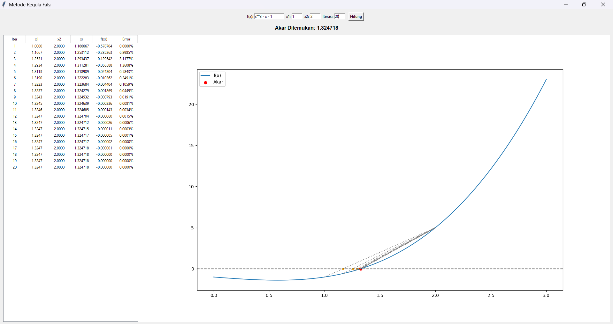
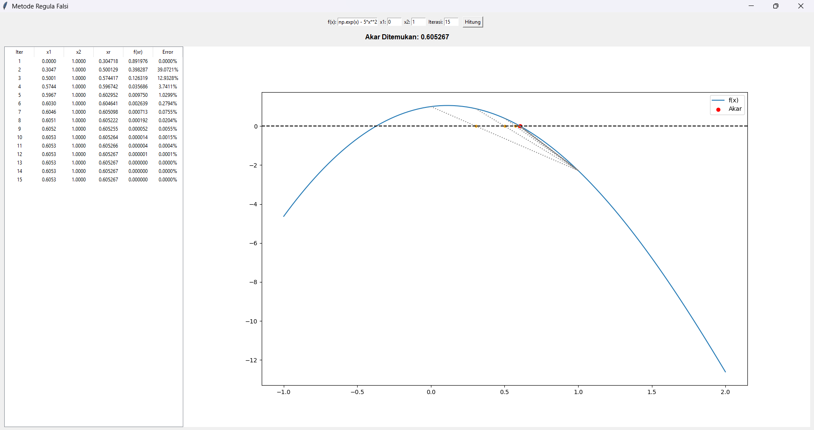
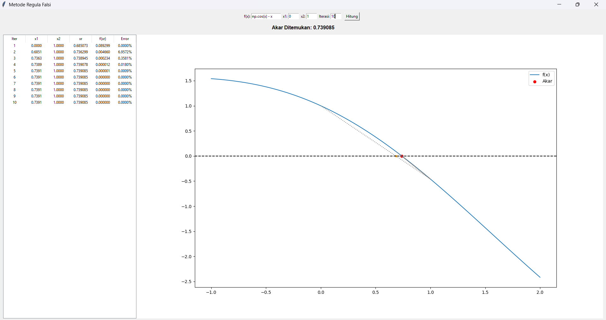
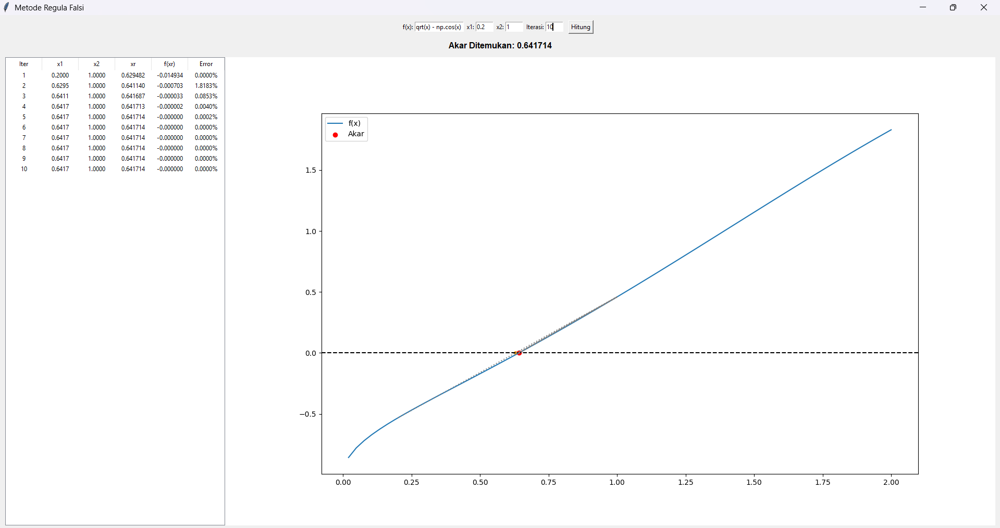

# Laporan Praktikum 1 Komputasi Numerik

|    NRP     |           Nama             |
| :--------: |       :------------:       |
| 5025251055 |   Aga Nafta Filadelfiano   |
| 5025251061 |     Bayu Setyo Nugroho     |
| 5025251067 |     Azka Fairus Syamsa     |

## Metode Regula Falsi
Metode Regula Falsi atau disebut juga Metode Posisi Salah adalah salah satu metode akolade untuk menetukan akar persamaan sebuah fungsi. Metode ini sebenarnya menyerupai Metode Bolzano (Biseksi), namun memiliki tingkat konvergensi yang jauh lebih cepat sehingga hasilnya juga lebih baik. Pada dasarnya, metode ini bekerja dengan meng-interpolasi-kan 2 nilai fungsi yang berlawanan tanda.


## Cara Pengerjaan Metode Regula Falsi
*Langkah 1 :* Pilih dua titik awal x1 dan x2 sedemikian sehingga fungsi pada titik-titik tersebut memiliki tanda yang berlawanan, yaitu f(x1) ⋅ f(x2) < 0.

*Langkah 2 :* Hitung titik x3 di mana aproksimasi linear memotong sumbu x menggunakan rumus.

*Langkah 3 :* Tentukan f(x3).
- Jika f(x3) ⋅ f(x1) < 0, maka akarnya terletak di antara x1 dan x3. Tetapkan x2 = x3.
- Jika f(x3) ⋅ f(x2) < 0, maka akarnya terletak di antara x2 dan x3. Tetapkan x1 = x3.

*Langkah 4 :* Ulangi langkah-langkah tersebut (iterasi) hingga nilai |f(x3)| mendekati toleransi nilai eror yang telah ditentukan, maka x3 adalah akar persamaan yang dicari.

## Implementasi Algoritma Metode Regula Falsi (python)
[regulaFalsi.py](regulaFalsi.py)
```py
import numpy as np
import matplotlib.pyplot as plt
from matplotlib.backends.backend_tkagg import FigureCanvasTkAgg
import tkinter as tk
from tkinter import ttk, messagebox

def hitung_regula_falsi():
    try:
        f_str = entry_f.get()
        x1, x2 = float(entry_x1.get()), float(entry_x2.get())
        n = int(entry_n.get())

        def f(x): return eval(f_str, {"x": x, "np": np})

        if f(x1) * f(x2) >= 0:
            messagebox.showerror("Error", "f(x1) dan f(x2) harus beda tanda!")
            return

        for row in tree.get_children(): tree.delete(row)
        
        x1_awal, x2_awal = x1, x2
        history = []
        xr_old = 0

        for i in range(1, n + 1):
            fx1, fx2 = f(x1), f(x2)
            xr = x2 - (fx2 * (x1 - x2)) / (fx1 - fx2)
            fxr = f(xr)
            history.append((x1, x2, xr))
            err = abs((xr - xr_old) / xr) * 100 if i > 1 else 0
            tree.insert("", "end", values=(i, f"{x1:.4f}", f"{x2:.4f}", f"{xr:.6f}", f"{fxr:.6f}", f"{err:.4f}%"))

            if fx1 * fxr < 0: x2 = xr
            else: x1 = xr
            xr_old = xr

        lbl_hasil.config(text=f"Akar Ditemukan: {xr:.6f}")
        update_grafik(f, x1_awal, x2_awal, xr, history)

    except Exception as e:
        messagebox.showerror("Error", f"Terjadi kesalahan: {e}")

def update_grafik(f, a, b, root_val, history):
    ax.clear()
    x_plt = np.linspace(a - 1, b + 1, 100)
    
    ax.plot(x_plt, [f(i) for i in x_plt], label="f(x)")
    ax.axhline(0, color='black', linestyle='--')
    
    for a_i, b_i, c_i in history:
        ax.plot([a_i, b_i], [f(a_i), f(b_i)], ':', color='gray')
        ax.scatter(c_i, 0, color='orange', s=15)

    ax.scatter(root_val, f(root_val), color='red', label="Akar")
    ax.legend()
    canvas.draw()

root = tk.Tk()
root.title("Metode Regula Falsi")

frame_in = tk.Frame(root)
frame_in.pack(pady=10)

tk.Label(frame_in, text="f(x):").grid(row=0, column=0)
entry_f = tk.Entry(frame_in, width=15); 
entry_f.grid(row=0, column=1); 
entry_f.insert(0, "x**2 + 5*x -3")

tk.Label(frame_in, text=" x1:").grid(row=0, column=2)
entry_x1 = tk.Entry(frame_in, width=5); 
entry_x1.grid(row=0, column=3); 
entry_x1.insert(0, "0")

tk.Label(frame_in, text=" x2:").grid(row=0, column=4)
entry_x2 = tk.Entry(frame_in, width=5); 
entry_x2.grid(row=0, column=5); 
entry_x2.insert(0, "1")

tk.Label(frame_in, text=" Iterasi:").grid(row=0, column=6)
entry_n = tk.Entry(frame_in, width=5); 
entry_n.grid(row=0, column=7); 
entry_n.insert(0, "10")

tk.Button(frame_in, text="Hitung", command=hitung_regula_falsi).grid(row=0, column=8, padx=10)

lbl_hasil = tk.Label(root, text="Akar: -", font=("Arial", 12, "bold"))
lbl_hasil.pack()

frame_out = tk.Frame(root)
frame_out.pack(fill="both", expand=True, padx=10, pady=10)

cols = ("Iter", "x1", "x2", "xr", "f(xr)", "Error")
tree = ttk.Treeview(frame_out, columns=cols, show="headings", height=10)
for c in cols: 
    tree.heading(c, text=c)
    tree.column(c, width=70, anchor="center")
tree.pack(side="left", fill="y")

fig, ax = plt.subplots(figsize=(5, 4))
canvas = FigureCanvasTkAgg(fig, master=frame_out)
canvas.get_tk_widget().pack(side="right", fill="both", expand=True)

root.mainloop()
```

## Penjelasan Kode Program
bayu&aga
### Logika Perhitungan Regula Falsi
```py
def hitung_regula_falsi():
    ...
    xr = x2 - (fx2 * (x1 - x2)) / (fx1 - fx2)
    ...
    if fx1 * fxr < 0: x2 = xr
    else: x1 = xr
```
- `xr = x2 - ...` : Rumus interpolasi linear untuk mencari titik potong garis lurus pada sumbu x.

- `f(x1) * f(x2) >= 0` : Mengecek syarat awal; nilai fungsi pada kedua batas harus berbeda tanda agar akar dapat ditemukan.

- `if fx1 * fxr < 0` : Logika pembaruan batas; jika tanda fungsi di xr sama dengan x1, maka x1 digantikan oleh xr, dan sebaliknya.

abs((xr - xr_old) / xr) * 100 : Menghitung persentase galat (error) relatif untuk setiap iterasi.
### Inisialisasi Jendela Program
```py
root = tk.Tk()
root.title("Metode Regula Falsi")
```
- `root=tk.Tk()`: Membuat jendela utama program.
- `root.title`: Mengatur judul program.

### Membuat Panel Input
```py
tk.Label(frame_in, text="f(x):").grid(row=0, column=0)
entry_f = tk.Entry(frame_in, width=15); 
entry_f.grid(row=0, column=1); 
entry_f.insert(0, "x**2 + 5*x -3")
```
- `tk.Label`: Menampilkan teks sebagai keterangan di sebelah kiri.
- `tk.Entry`: Kotak putih tempat user mengetikkan nilai.
- `.grid(...)`: Menempatkan widget menggunakan sistem koordinat row dan column.
- `.insert(0, "...")`: Memberikan nilai default di dalam kotak.
- Kode ini berulang untuk x1, x2, dan Iterasi

### Menambahkan Tombol Eksekusi
```py
tk.Button(frame_in, text="Hitung", command=hitung_regula_falsi).grid(row=0, column=8, padx=10)
```
- `command=hitung_regula_falsi`: Menghubungkan tombol dengan fungsi logika regula_falsi yang sudah ada.

### Menampilkan Tabel Hasil Iterasi
```py
cols = ("Iter", "x1", "x2", "xr", "f(xr)", "Error")
tree = ttk.Treeview(frame_out, columns=cols, show="headings", height=10)
for c in cols: 
    tree.heading(c, text=c)
    tree.column(c, width=70, anchor="center")
tree.pack(side="left", fill="y")
```
- `ttk.Treeview`: Untuk membuat tabel.
- columns: Menampilkan judul kolom.
- `anchor="center"`: Membuat data angka di dalam tabel berada di posisi tengah.

### Menambahkan Scrollbar dan Hasil Akhir
```py
fig, ax = plt.subplots(figsize=(5, 4))
canvas = FigureCanvasTkAgg(fig, master=frame_out)
canvas.get_tk_widget().pack(side="right", fill="both", expand=True)
```
- `plt.subplots()`: Untuk membuat dua objek sekaligus, yaitu fig dan ax.
- `FigureCanvasTkAgg`: Sebagai penghubung agar Matplotlib dikenali oleh Tkinter.
- `fill="both"`: Untuk membuat grafik untuk memenuhi ruang yang tersedia.
- `expand=True`: Agar grafik bersifat responsif, dimana bila user memperbesar jendela, maka grafik akan ikut membesar secara otomatis.

### Melakukan Perulangan
```py
root.mainloop()
```
Bertujuan agar program terus berjalan untuk mendengarkan klik/input dari user.


## Screenshot Hasil Program 
### Polinomial
#### `f(x) = x^3 - x - 1`
`x1 = 1` `x2 = 2` `Iterasi = 20`


### Eksponensial
#### `f(x) = e^x - 5x^2`
`x1 = 0` `x2 = 1` `Iterasi = 15`


### Trigonometri
#### `f(x) = cos(x) - x`
`x1 = 0` `x2 = 1` `Iterasi = 10`


### Logaritma Natural
#### `f(x) = xln(x) - 10`
`x1 = 1` `x2 = 10` `Iterasi = 10`


### Kombinasi Akar
#### `f(x) = x^0.5 - cos(x)`
`x1 = 0.2` `x2 = 1` `Iterasi = 10`

