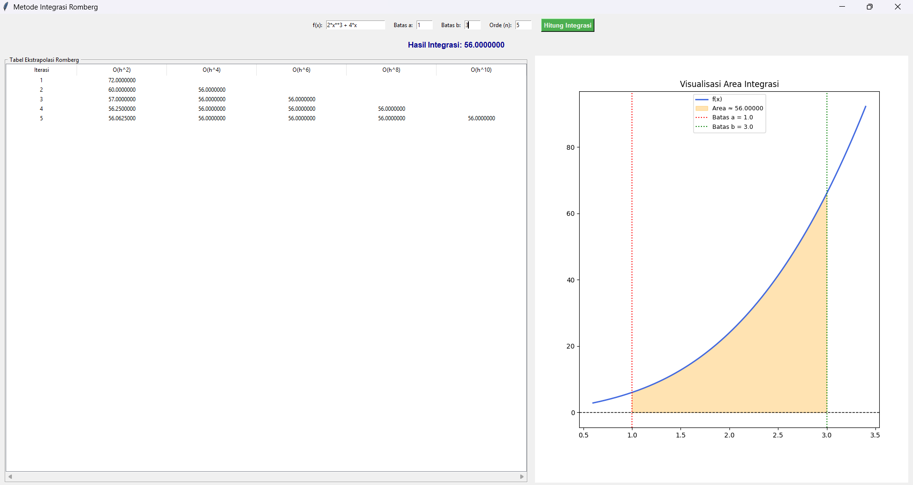
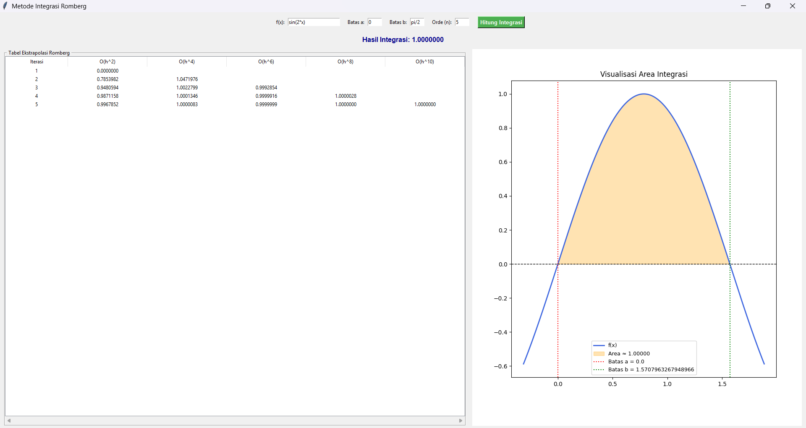
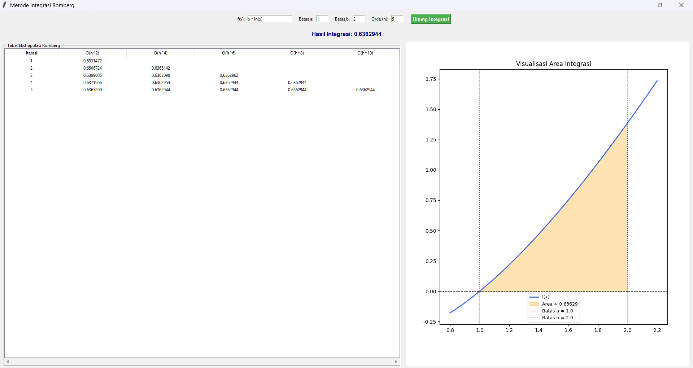
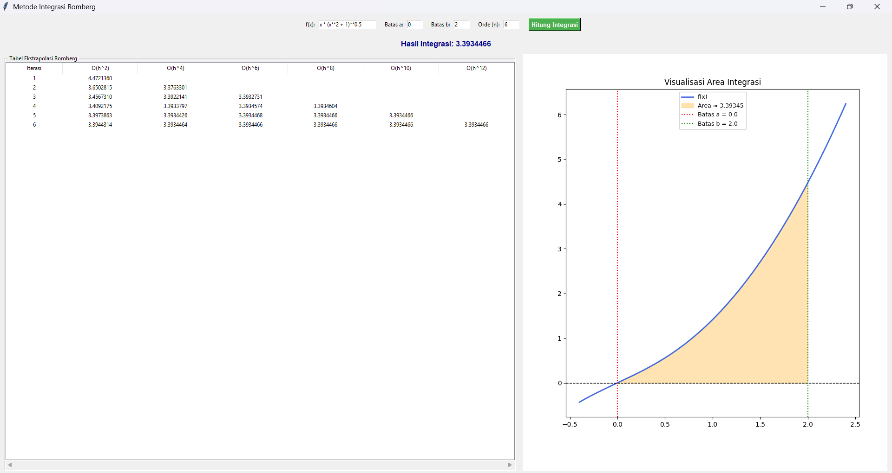

# Laporan Praktikum 2 Komputasi Numerik (D) Kelompok 8

|    NRP     |           Nama             |
| :--------: |       :------------:       |
| 5025251055 |   Aga Nafta Filadelfiano   |
| 5025251061 |     Bayu Setyo Nugroho     |
| 5025251067 |     Azka Fairus Syamsa     |


## Metode Integrasi Romberg
Metode Integrasi Romberg adalah salah satu metode numerik untuk menghitung nilai integral tentu suatu fungsi dengan tingkat akurasi yang tinggi. Metode ini bekerja dengan mengombinasikan hasil perhitungan Metode Trapesium pada beberapa ukuran segmen (h) yang berbeda, kemudian melakukan ekstrapolasi Richardson untuk mengurangi galat (error) secara bertahap. Dengan pendekatan ini, Metode Romberg dapat menghasilkan nilai integral yang jauh lebih akurat dibandingkan Metode Trapesium biasa, meskipun jumlah segmen yang digunakan relatif sedikit.


## Cara Pengerjaan Metode Integrasi Romberg
**Langkah 1 :** Tentukan fungsi f(x) yang akan diintegralkan beserta batas bawah (a) dan batas atas (b).

**Langkah 2 :** Hitung nilai integral menggunakan Metode Trapesium untuk beberapa ukuran segmen yang berbeda (misalnya dengan n = 1, 2, 4, 8, ... segmen), sehingga diperoleh nilai-nilai I(h).

**Langkah 3 :** Susun hasil perhitungan tersebut ke dalam tabel Romberg, dengan kolom pertama berisi hasil Metode Trapesium.

**Langkah 4 :** Lakukan ekstrapolasi Richardson untuk menghitung kolom-kolom berikutnya menggunakan rumus.
- Setiap kolom baru menggunakan kombinasi dua nilai pada kolom sebelumnya untuk mengurangi orde galat.

**Langkah 5 :** Ulangi proses ekstrapolasi hingga selisih antar nilai pada kolom terakhir mendekati toleransi eror yang telah ditentukan, maka nilai tersebut adalah hasil integral yang dicari.

**Rumus Integrasi Romberg**
- Rumus rekursif:


- Untuk iterasi pertama (j = 1) menggunakan aturan dasar Trapesium


## Implementasi Algoritma Metode Integrasi Romberg (python)
[romberg.py](romberg.py)
```py
import numpy as np
import matplotlib.pyplot as plt
from matplotlib.backends.backend_tkagg import FigureCanvasTkAgg
import tkinter as tk
from tkinter import ttk, messagebox

def hitung_romberg():
    try:
        f_str = entry_f.get()
        calc_dict = {"np": np, "sin": np.sin, "cos": np.cos, "tan": np.tan, "exp": np.exp, "pi": np.pi, "log": np.log, "ln": np.log}
        a = float(eval(entry_a.get(), calc_dict))
        b = float(eval(entry_b.get(), calc_dict))
        n = int(entry_n.get())

        if n < 1 or n > 15:
            messagebox.showwarning("Peringatan", "Nilai n maksimal adalah 15 agar komputasi tetap stabil.")
            return
        
        def f(x): 
            return eval(f_str, {"x": x, "np": np, "sin": np.sin, "cos": np.cos, "tan": np.tan, "exp": np.exp, "pi": np.pi, "log": np.log, "ln": np.log})

        R = np.zeros((n, n))

        h = b - a
        R[0, 0] = (h / 2.0) * (f(a) + f(b))

        for k in range(1, n):
            h = (b - a) / (2**k)
            sum_f = sum(f(a + i * h) for i in range(1, 2**k, 2))
            R[k, 0] = 0.5 * R[k-1, 0] + sum_f * h

            for j in range(1, k + 1):
                R[k, j] = R[k, j-1] + (R[k, j-1] - R[k-1, j-1]) / ((4**j) - 1)

        for row in tree.get_children():
            tree.delete(row)
        
        cols = ["Iterasi"] + [f"O(h^{2*(i+1)})" for i in range(n)]
        tree["columns"] = cols
        for c in cols:
            tree.heading(c, text=c)
            tree.column(c, width=60 if c == "Iterasi" else 100, anchor="center")

        for k in range(n):
            row_data = [k + 1] + [f"{R[k, j]:.7f}" if j <= k else "" for j in range(n)]
            tree.insert("", "end", values=row_data)

        hasil_akhir = R[n-1, n-1]
        lbl_hasil.config(text=f"Hasil Integrasi: {hasil_akhir:.7f}")
        
        update_grafik(f, a, b, hasil_akhir)

    except Exception as e:
        messagebox.showerror("Error", f"Terjadi kesalahan penulisan fungsi atau perhitungan:\n{e}")

def update_grafik(f, a, b, luas_area):
    ax.clear()
    
    margin = abs(b - a) * 0.2 if a != b else 1
    x_plt = np.linspace(a - margin, b + margin, 200)
    y_plt = [f(i) for i in x_plt]
    
    ax.plot(x_plt, y_plt, label="f(x)", color="royalblue", linewidth=2)
    ax.axhline(0, color='black', linestyle='--', linewidth=1)

    x_fill = np.linspace(a, b, 100)
    y_fill = [f(i) for i in x_fill]
    ax.fill_between(x_fill, y_fill, alpha=0.3, color="orange", label=f"Area ≈ {luas_area:.5f}")
    
    ax.axvline(a, color='red', linestyle=':', label=f"Batas a = {a}")
    ax.axvline(b, color='green', linestyle=':', label=f"Batas b = {b}")

    ax.set_title("Visualisasi Area Integrasi")
    ax.legend(loc="best", fontsize=9)
    canvas.draw()

root = tk.Tk()
root.title("Metode Integrasi Romberg")
root.geometry("1920x1080") 

frame_in = tk.Frame(root)
frame_in.pack(pady=10)

tk.Label(frame_in, text="f(x):").grid(row=0, column=0, padx=5)
entry_f = tk.Entry(frame_in, width=20) 
entry_f.grid(row=0, column=1) 
entry_f.insert(0, "4 / (1 + x**2)") 

tk.Label(frame_in, text="Batas a:").grid(row=0, column=2, padx=(15, 5))
entry_a = tk.Entry(frame_in, width=5) 
entry_a.grid(row=0, column=3) 
entry_a.insert(0, "0")

tk.Label(frame_in, text="Batas b:").grid(row=0, column=4, padx=(15, 5))
entry_b = tk.Entry(frame_in, width=5) 
entry_b.grid(row=0, column=5) 
entry_b.insert(0, "1")

tk.Label(frame_in, text="Orde (n):").grid(row=0, column=6, padx=(15, 5))
entry_n = tk.Entry(frame_in, width=5) 
entry_n.grid(row=0, column=7) 
entry_n.insert(0, "5")

tk.Button(frame_in, text="Hitung Integrasi", command=hitung_romberg, bg="#4CAF50", fg="white", font=("Arial", 10, "bold")).grid(row=0, column=8, padx=20)

lbl_hasil = tk.Label(root, text="Hasil Integrasi Terbaik: -", font=("Arial", 12, "bold"), fg="darkblue")
lbl_hasil.pack(pady=5)

frame_out = tk.Frame(root)
frame_out.pack(fill="both", expand=True, padx=10, pady=5)

frame_tabel_container = tk.LabelFrame(frame_out, text=" Tabel Ekstrapolasi Romberg ", width=1100)
frame_tabel_container.pack(side="left", fill="both", expand=False)
frame_tabel_container.grid_propagate(False)

tree_scroll = ttk.Scrollbar(frame_tabel_container, orient="horizontal")
tree = ttk.Treeview(frame_tabel_container, show="headings", xscrollcommand=tree_scroll.set)
tree_scroll.config(command=tree.xview)

tree.grid(row=0, column=0, sticky="nsew")
tree_scroll.grid(row=1, column=0, sticky="ew")

frame_tabel_container.grid_rowconfigure(0, weight=1)
frame_tabel_container.grid_columnconfigure(0, weight=1)

fig, ax = plt.subplots(figsize=(5, 4))
fig.tight_layout(pad=2.0)
canvas = FigureCanvasTkAgg(fig, master=frame_out)
canvas.get_tk_widget().pack(side="right", fill="both", expand=True, padx=(15, 0))

hitung_romberg()

root.mainloop()
```

## Penjelasan Kode Program
### 1. Mengimpor Library
```py
import numpy as np
import matplotlib.pyplot as plt
from matplotlib.backends.backend_tkagg import FigureCanvasTkAgg
import tkinter as tk
from tkinter import ttk, messagebox
```
- `numpy` (`np`): Pustaka inti untuk komputasi numerik di Python. Pada program ini, `numpy` digunakan untuk membuat matriks perhitungan (`np.zeros`), menghasilkan titik-titik koordinat secara merata untuk grafik (`np.linspace`), serta menyediakan fungsi dan konstanta matematika bawaan (seperti `np.sin`, `np.cos`, `np.pi`).
- `tkinter` (`tk`, `ttk`, `messagebox`): Pustaka standar Python untuk membuat antarmuka pengguna grafis (GUI). `tk` digunakan untuk membuat jendela utama dan elemen dasar (tombol, label, input teks). `ttk` digunakan untuk elemen GUI yang lebih modern seperti tabel data (`Treeview`), sedangkan `messagebox` digunakan untuk menampilkan jendela pop-up peringatan atau error.
- `matplotlib` & `FigureCanvasTkAgg`: Pustaka untuk visualisasi data (membuat grafik). Modul `pyplot` digunakan untuk menggambar kurva dan mengarsir area integral. Sementara itu, `FigureCanvasTkAgg` bertindak sebagai "jembatan" yang memungkinkan grafik dari Matplotlib ditempelkan (embedded) langsung ke dalam jendela aplikasi Tkinter.

### 2. Mendefinisikan Fungsi Logika Perhitungan Metode Romberg
```py
def hitung_romberg():
    ...
    calc_dict = {"np": np, "sin": np.sin, "cos": np.cos, ...}
    a = float(eval(entry_a.get(), calc_dict))
    ...
    R = np.zeros((n, n))
    R[0, 0] = (h / 2.0) * (f(a) + f(b))
    
    for k in range(1, n):
        ...
        for j in range(1, k + 1):
            R[k, j] = R[k, j-1] + (R[k, j-1] - R[k-1, j-1]) / ((4**j) - 1)
```
- `calc_dict & eval(...)`: Membuat kamus (dictionary) kustom yang berfungsi memetakan string teks menjadi fungsi matematika riil. Fitur ini memungkinkan pengguna untuk mengetikkan fungsi trigonometri atau konstanta seperti `sin(x)`, `cos(x)`, `exp(x)`, atau `pi` langsung dari antarmuka tanpa memicu error.
- `R = np.zeros((n, n))`: Menginisialisasi matriks persegi kosong berukuran $n \times n$ menggunakan NumPy yang nantinya digunakan sebagai wadah penyimpanan Tabel Romberg.
- `R[0, 0] = ...`: Tahap awal komputasi yang menghitung nilai integral pertama menggunakan Aturan Trapesium (Trapezoidal Rule) dengan 1 segmen selang (orde galat O(h^2)). Rumus matematisnya: $$R_{0, 0} = \frac{h}{2} [f(a) + f(b)]$$
- `R[k, 0] = ...`: Mengisi kolom pertama matriks dengan mengevaluasi Aturan Trapesium Komposit (menambahkan titik-titik pias baru di tengah selang sebelumnya). Rumus matematisnya: $$R_{k, 0} = \frac{1}{2} R_{k-1, 0} + h \sum_{i=1}^{2^{k-1}} f(a + (2i - 1)h)$$
- `R[k, j] = ...`: Baris ini merupakan inti dari Algoritma Romberg, yaitu menerapkan teknik Ekstrapolasi Richardson. Tujuannya adalah mengeliminasi suku-suku galat secara bertahap agar nilai integrasi menjadi jauh lebih akurat melalui kombinasi linear dari nilai integral pada langkah sebelumnya. Secara matematis, pengisian sel matriks ini mengikuti rumus:
  $$R_{k, j} = R_{k, j-1} + \frac{R_{k, j-1} - R_{k-1, j-1}}{4^j - 1}$$

### 3. Melakukan Proses Iterasi dan Pembaruan Tabel (Treeview Dinamis)
```py
cols = ["Iterasi"] + [f"O(h^{2*(i+1)})" for i in range(n)]
tree["columns"] = cols
...
for k in range(n):
    row_data = [k + 1] + [f"{R[k, j]:.7f}" if j <= k else "" for j in range(n)]
    tree.insert("", "end", values=row_data)
```
- Kolom Dinamis (`cols = ...`): Karena dimensi matriks Romberg bersifat fleksibel tergantung nilai variabel `n` yang dimasukkan pengguna, kolom pada komponen `Treeview` dibuat secara otomatis. Nama kolom diatur untuk merepresentasikan tingkat orde galat teoretisnya, mulai dari O(h^2), O(h^4), O(h^6), hingga O(h^{2n}).
- Kondisi `if j <= k else ""`: Mengingat skema perhitungan Romberg hanya menghasilkan matriks segitiga bawah (lower triangular matrix), logika kondisional ini memastikan hanya elemen matriks yang valid saja yang dicetak ke dalam tabel. Sisa sel kosong di sebelah kanan akan diisi string kosong (`""`) agar visualisasi tabel tetap rapi.

### 4. Memvisualisasi Grafik Interaktif
```py
def update_grafik(f, a, b, luas_area):
    ...
    ax.fill_between(x_fill, y_fill, alpha=0.3, color="orange", label=f"Area ≈ {luas_area:.5f}")
    ax.axvline(a, color='red', linestyle=':', label=f"Batas a = {a}")
    ax.axvline(b, color='green', linestyle=':', label=f"Batas b = {b}")

    ax.set_title("Visualisasi Area Integrasi")
    ax.legend(loc="best", fontsize=9)
    canvas.draw()
```
- `ax.fill_between(...)`: Berfungsi memberikan efek arsir atau blok warna di area bawah kurva fungsi `f(x)` yang dibatasi oleh titik batas bawah `a` dan batas atas `b`. Parameter `alpha=0.3` mengatur tingkat transparansi warna oranye agar garis kisi (grid) di belakangnya tetap terlihat.
- `ax.axvline(...)`: Menarik garis vertikal statis secara tegak lurus pada titik koordinat batas bawah `a` (warna merah) dan batas atas `b` (warna hijau) untuk mempertegas batas-batas wilayah integrasi kepada pengguna secara visual.
- `ax.set_title(...)`: Memberikan judul utama pada bagian atas grafik ("Visualisasi Area Integrasi") agar pengguna mengerti konteks dari gambar yang ditampilkan.
- `ax.legend(...)`: Memunculkan kotak legenda yang berisi keterangan makna dari setiap warna dan garis pada grafik (seperti label kurva f(x), area integrasi, dan garis batas). Penggunaan parameter `loc="best"` sangat praktis karena memerintahkan algoritma Matplotlib untuk secara otomatis mencari area kosong di dalam grafik dan meletakkan legenda di sana, sehingga tidak menutupi kurva atau area arsiran.
- `canvas.draw()`: Ini adalah perintah pamungkas dan paling krusial. Setelah semua elemen (kurva, batas, warna area, judul, dan legenda) selesai diatur di latar belakang, `canvas.draw()` bertugas untuk "menggambar ulang" (render) kanvas Tkinter agar semua perubahan visual tersebut benar-benar muncul dan diperbarui di layar antarmuka pengguna.

### 5. Spesifikasi Input dan Output Program
A. Komponen Input
```py
f_str = entry_f.get()
a = float(eval(entry_a.get(), calc_dict))
b = float(eval(entry_b.get(), calc_dict))
n = int(entry_n.get())

if n < 1 or n > 15:
    messagebox.showwarning("Peringatan", "Nilai n maksimal adalah 15 agar komputasi tetap stabil.")
    return
```
- `f(x)` (Fungsi): Persamaan matematika yang akan dihitung integralnya. Diambil melalui perintah `entry_f.get()`.
- Batas `a` & `b`: Nilai numerik batas bawah dan batas atas integrasi. Diambil menggunakan `eval(entry_a.get(), calc_dict)` agar mendukung input ekspresi matematika (built-in).
- Iterasi (`n`): Menentukan ukuran matriks Romberg. Diambil menggunakan `int(entry_n.get())`. Terdapat validasi `if n < 1 or n > 15` untuk mencegah komputasi yang terlalu berat dan menjaga stabilitas program.
  
B. Komponen Output
```py
hasil_akhir = R[n-1, n-1]
lbl_hasil.config(text=f"Hasil Integrasi: {hasil_akhir:.7f}")

for k in range(n):
    row_data = [k + 1] + [f"{R[k, j]:.7f}" if j <= k else "" for j in range(n)]
    tree.insert("", "end", values=row_data)

update_grafik(f, a, b, hasil_akhir)
```
- Hasil Integrasi Akhir: Mengambil nilai kalkulasi dari sel ujung kanan bawah matriks, yaitu `R[n-1, n-1]`. Titik ini memiliki estimasi galat terkecil. Nilai ini ditampilkan ke UI menggunakan `lbl_hasil.config(...)`.
- abel Ekstrapolasi: Ditampilkan melalui `tree.insert(...)`, menunjukkan perbaikan nilai integral dari orde rendah ke orde tinggi di setiap iterasi.
- Grafik Visual: Dieksekusi melalui pemanggilan fungsi `update_grafik(...)`, yang menggambar kurva fungsi, mewarnai area integral, dan menempatkan garis penanda batas secara dinamis.

### 6. Menginisialisasi Jendela Utama Aplikasi
```py
root = tk.Tk()
root.title("Metode Integrasi Romberg")
root.geometry("1920x1080") 
```
- `root = tk.Tk()`: Berfungsi untuk membuat objek jendela utama (main window) dari aplikasi GUI menggunakan pustaka Tkinter.
- `root.title("Metode Integrasi Romberg")`: Berfungsi untuk mengatur teks pada bilah judul jendela aplikasi menjadi "Metode Integrasi Romberg".
- `root.geometry("1920x1080")`: Berfungsi untuk mengatur dimensi ukuran default jendela aplikasi saat pertama kali dijalankan.

### 7. Membuat Kontainer dan Komponen Input Parameter
```py
frame_in = tk.Frame(root)
frame_in.pack(pady=10)

tk.Label(frame_in, text="f(x):").grid(row=0, column=0, padx=5)
entry_f = tk.Entry(frame_in, width=20) 
entry_f.grid(row=0, column=1) 
entry_f.insert(0, "4 / (1 + x**2)") 

tk.Label(frame_in, text="Batas a:").grid(row=0, column=2, padx=(15, 5))
entry_a = tk.Entry(frame_in, width=5) 
entry_a.grid(row=0, column=3) 
entry_a.insert(0, "0")

tk.Label(frame_in, text="Batas b:").grid(row=0, column=4, padx=(15, 5))
entry_b = tk.Entry(frame_in, width=5) 
entry_b.grid(row=0, column=5) 
entry_b.insert(0, "1")

tk.Label(frame_in, text="Orde (n):").grid(row=0, column=6, padx=(15, 5))
entry_n = tk.Entry(frame_in, width=5) 
entry_n.grid(row=0, column=7) 
entry_n.insert(0, "5")

tk.Button(frame_in, text="Hitung Integrasi", command=hitung_romberg, bg="#4CAF50", fg="white", font=("Arial", 10, "bold")).grid(row=0, column=8, padx=20)
```
- `frame_in = tk.Frame(root)`: Membuat sebuah kontainer khusus di bagian atas jendela untuk mengelompokkan semua komponen input data agar tata letaknya rapi.
- `tk.Label()`: Membuat label bagi user untuk mengetahui letak pengisian fungsi f(x), batas bawah (a), batas atas (b), dan jumlah orde (n).
- `tk.Entry()`: Menyediakan kotak teks input sebagai tempat user untuk mengetikkan persamaan matematika dan parameter batas integrasi.
- `.insert(0, "...")`: Memberikan nilai default pada masing-masing kotak input saat program pertama kali dibuka untuk memudahkan simulasi awal.
- `.grid(row=..., column=...)`: Mengatur tata letak komponen label dan kotak input menggunakan sistem koordinat baris dan kolom agar tersusun sejajar secara horizontal.
- `tk.Button(..., command=hitung_romberg)`: Membuat tombol eksekusi yang jika diklik oleh user akan memanggil fungsi hitung_romberg untuk memproses kalkulasi matematika.

### 8. Membuat Komponen Teks Hasil Integrasi
```py
lbl_hasil = tk.Label(root, text="Hasil Integrasi: -", font=("Arial", 12, "bold"), fg="darkblue")
lbl_hasil.pack(pady=5)
```
- `lbl_hasil = tk.Label()`: Membuat komponen teks untuk menampilkan nilai integral yang paling akurat.
- `fg="darkblue" dan font=()`: Mengatur tampilan visual teks agar berwarna biru tua, berukuran lebih besar, dan dicetak tebal.
- `.pack(pady=5)`: Memasang label hasil di jendela utama dengan memberikan jarak vertikal sebesar 5 piksel dari komponen di atas dan bawahnya.

### 9. Membuat Kontainer Output Data
```py
frame_out = tk.Frame(root)
frame_out.pack(fill="both", expand=True, padx=10, pady=5)
```
- `frame_out = tk.Frame(root)`: Membuat objek kontainer  yang berfungsi menampung visualisasi data hasil perhitungan.
- `fill="both", expand=True`: Mengonfigurasi frame agar ukurannya bersifat responsif, di mana kontainer ini akan otomatis melebar dan memenuhi seluruh sisa ruang kosong yang tersedia pada jendela aplikasi.

### 10. Melakukan Konfigurasi Kontainer Tabel Matriks Romberg
```py
frame_tabel_container = tk.LabelFrame(frame_out, text=" Tabel Ekstrapolasi Romberg ", width=1100)
frame_tabel_container.pack(side="left", fill="both", expand=False)
frame_tabel_container.grid_propagate(False)

tree_scroll = ttk.Scrollbar(frame_tabel_container, orient="horizontal")
tree = ttk.Treeview(frame_tabel_container, show="headings", xscrollcommand=tree_scroll.set)
tree_scroll.config(command=tree.xview)

tree.grid(row=0, column=0, sticky="nsew")
tree_scroll.grid(row=1, column=0, sticky="ew")

frame_tabel_container.grid_rowconfigure(0, weight=1)
frame_tabel_container.grid_columnconfigure(0, weight=1)
```
- `tk.LabelFrame(..., text="...", width=1100)`: Membuat kontainer tabel khusus di sebelah kiri dan judul teks di atasnya. 
- `frame_tabel_container.grid_propagate(False)`: Menonaktifkan fitur propagasi otomatis. Hal ini bertujuan agar dimensi lebar kontainer tidak ikut molor atau membesar saat tabel di dalamnya melebar.
- `ttk.Scrollbar(..., orient="horizontal")`: Membuat komponen scrollbar horizontal yang diletakkan di bagian bawah tabel.t
- `tk.Treeview(..., show="headings")`: Membuat komponen struktur tabel data untuk menampilkan baris dan kolom matriks segitiga hasil ekstrapolasi Romberg.
- `xscrollcommand=tree_scroll.set` dan `tree_scroll.config(...)`: Menghubungkan pergeseran antara komponen Treeview dengan komponen Scrollbar horizontal.
- `.grid(row=..., sticky="nsew")`: Menyusun tabel dan komponen penggeser di dalam kontainer agar tampilan tabel memenuhi kontainer secara penuh.

### 11. Menyematkan Grafik Matplotlib
```py
fig, ax = plt.subplots(figsize=(5, 4))
fig.tight_layout(pad=2.0)
canvas = FigureCanvasTkAgg(fig, master=frame_out)
canvas.get_tk_widget().pack(side="right", fill="both", expand=True, padx=(15, 0))
```
- `plt.subplots(figsize=(5, 4))`: Menginisialisasi objek figur grafik (fig) dan sumbu koordinat kartesian menggunakan pustaka Matplotlib.
- `fig.tight_layout(pad=2.0)`: Mengatur otomatis margin dan spasi komponen grafik agar label sumbu dan judul grafik tidak terpotong atau saling tumpang tindih.
- `FigureCanvasTkAgg(fig, master=frame_out)`: Bertindak sebagai interface connector dan mengonversi figur visual dari Matplotlib menjadi sebuah widget yang dapat dikenali di dalam ekosistem jendela Tkinter.
- `canvas.get_tk_widget().pack(side="right", ...)`: Menempatkan widget grafik tersebut di area sebelah kanan dalam kontainer output.

### 12. Melakukan Eksekusi Awal dan Loop Utama Aplikasi
```py
hitung_romberg()

root.mainloop()
```
- `hitung_romberg()`: Memanggil fungsi kalkulasi secara langsung saat program pertama kali dibuka untuk memicu kalkulasi berdasarkan fungsi bawaan.
- `root.mainloop()`: Memulai siklus perulangan utama aplikasi GUI Tkinter untuk menjaga jendela program tetap terbuka, memantau interaksi user, dan terus memperbarui tampilan grafik serta tabel secara real-time.

## Screenshot Hasil Program 
### Polinomial
#### `f(x) = 2x^3 + 4x`
`Batas a = 1` `Batas b = 3` `Orde(n) = 5`


### Eksponensial
#### `f(x) = exp(2x)`
`Batas a = 0` `Batas b = 1` `Orde(n) = 6`


### Trigonometri
#### `f(x) = sin(2x)`
`Batas a = 0` `Batas b = pi/2` `Orde(n) = 5`


### Logaritma Natural
#### `f(x) = x ln(x)`
`Batas a = 1` `Batas b = 2` `Orde(n) = 5`


### Kombinasi Akar
#### `f(x) = x (x^2 + 1)^0.5`
`Batas a = 0` `Batas b = 2` `Orde(n) = 6`

